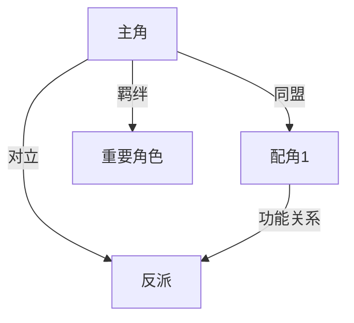

# 产物创建模板

各产物的标准模板与创建指引。agent 在 Phase 2-3 过渡时按需加载此文件。

**模板列表：**
- 设定/关系.md
- 设定/题材定位.md
- 大纲/卷纲_第X卷.md（含情绪弧线+反转规划）
- 大纲/细纲_第XXX章.md（含嵌入合约 frontmatter，含钩子议程字段）
- 追踪/状态.md（合并：伏笔+时间线+角色状态+功法状态）
- 追踪/快照/chapter_{N}.state.md（按章状态快照，只读副本，回滚锚点）
- 对标/{对标书名}/拆文报告.md
- 对标/{对标书名}/原文/第XXX章_{章名}.md

**层级关系：**
- 大纲.md = 全书鸟瞰（每卷一两句话定位）
- 卷纲_第X卷.md = 单卷规划（爽点节奏+情绪+人物+伏笔+反转）
- 细纲_第XXX章.md = 单章蓝图（事件+钩子+爽点+悬念，合约字段嵌入 frontmatter）

---

## 对标/{对标书名}/拆文报告.md

> **拆文库/对标关系**：`拆文库/` = analyze skill 的原始产出（数据源）。`对标/` = 写作项目的引用视图。首次引用时从 `拆文库/` 复制到 `对标/`。

此文件由 `write-novel-long-analyze` 拆解管道输出（快速预览报告或完整拆文报告）。write skill 的职责是**读取**，不创建。

如需手动创建简版对标摘要（未使用 analyze skill 时）：

```markdown
# {对标书名} 对标摘要

## 基本信息
- 书名：{}
- 作者：{}
- 题材/类型：{}
- 目标平台：{}
- 成绩：{均订/在读/热度}

## 核心发现
- 开篇钩子：{类型 + 手法}
- 爽点密度：{约 N 字/次}
- 节奏模式：{描述}
- 可借鉴套路：
  1. {}
  2. {}
  3. {}

## 禁止照搬
- {}（只学结构，不抄桥段）
```

创建参考：`plot-special-topics.md` (对标书选择法则)

---

## 设定/世界观.md

由 story-setup Phase 1.6 或 story-long-write Phase 2 产出。按目标字数分级：<100 万字使用简化模板（每板块 2-5 行），>=100 万字使用完整模板（每板块 5-15 行）。

```markdown
---
era: ""
world_type: ""
power_system: ""
target_words: 0
---

# 世界观设定

## 时代背景
- 时代/年份：{}
- 历史阶段：{}
- 关键历史事件：{}
- 当前局势：{}

## 地理环境
- 主要地域：{}
- 势力范围：{}
- 特色地貌：{}
- 重要地点：{}

## 势力格局
- 核心势力：{名称 + 定位 + 实力等级}
- 次级势力：{同上}
- 势力关系：{敌对/同盟/中立矩阵}
- 权力结构：{宗门/家族/国家/组织层级}

## 力量体系
- 体系类型：{修炼/魔法/科技/异能/混合}
- 等级划分：{每级名称 + 特征 + 能力边界}
- 晋升规则：{如何升级 + 瓶颈 + 代价}
- 稀有度分布：{各等级人口占比}

## 社会结构
- 社会阶层：{}
- 资源分配规则：{}
- 货币经济：{}
- 信仰/意识形态：{}
- 日常交通/通信：{}

## 硬约束
- 不可违背的自然法则：{}
- 力量体系天花板：{}
- 社会禁忌：{}
```

创建参考：`outline-structure-theory.md` (世界观体系) + genre-specific 模板

---

## 大纲/剧情线.md

由 story-long-write Phase 3a 在卷纲设计前产出。显式分离主线与支线，供卷纲/细纲标注引用。

```markdown
# 剧情线

## 主线
- **线名**：{}
- **核心冲突**：{}
- **起止卷**：第{1}卷 - 第{N}卷
- **关键节点**：

| 节点 | 卷:章 | 事件描述 |
|------|-------|---------|
| 起点 | 1:1 | {} |
| 转折1 | {} | {} |
| 转折2 | {} | {} |
| 高潮 | {} | {} |
| 终点 | {} | {} |

## 支线

### 支线1：{线名}
- **类型**：{感情线/成长线/势力线/悬疑线/复仇线/日常线}
- **核心冲突**：{}
- **起止卷**：第{X}卷 - 第{Y}卷
- **状态**：{未开始/推进中/已完成}
- **关键节点**：

| 节点 | 卷:章 | 事件描述 |
|------|-------|---------|
| {} | {} | {} |

### 支线2：{线名}
...

## 线间关系
| 线A | 线B | 关系{交汇/因果/独立} | 交汇点（卷:章） |
|-----|-----|---------------------|----------------|
| {} | {} | {} | {} |
```

创建参考：`outline-methods.md` (大纲结构) + `outline-conflict.md` (矛盾设计)

---

## 对标/{对标书名}/原文/第XXX章_{章名}.md

对标书章节原文，由用户手动放入或拆文管道导入。

```markdown
# 第{N}章 {章名}

{本章完整原文内容}

---
> 来源：{手动输入 / write-novel-long-analyze 导入}
> 原始字数：{约N字}
```

---

## 设定/关系.md

```markdown
# 角色关系图

## 关系总览

| 角色 A | 角色 B | 关系类型{亲情/爱情/友情/敌对/师生/主从/利益/羁绊} | 情感倾向{正面/负面/中性/复杂} | 当前状态 | 起始章节 | 变化节点 |
|--------|--------|---------------------------------------------|-----------------------------|---------|---------|---------|
| {名} | {名} | {类型} | {倾向} | {描述} | 第{N}章 | {事件} |

## 关系演变

{角色A}<->{角色B}：
- 关系类型：{核心对立/核心同盟/核心羁绊/功能关系}
- 起点：{初始关系}
- 冲突点：{双方矛盾的具体体现}
- 变化预期：{预计变化方向，如"第3卷决裂、第5卷和解"}
- 转折：{章节·事件·变化}
- 当前：{现状}

## 核心冲突关系

{列出推动剧情的2-3对核心对立/合作关系，含冲突类型和强度}

## 羁绊图（文本描述）

{角色间的所有关系连线，可配 Mermaid 图}


```

创建参考：`character-relations.md` (人物关系类型 + 关系图绘制)

---

## 设定/题材定位.md

```markdown
# 题材定位

## 基本信息
- 题材类型：{玄幻/都市/系统/...}
- 风格定位：{爽文/正剧/轻松/暗黑/幽默}
- 目标读者画像：{年龄/阅读偏好/消费习惯}
- 核心梗：{一句话卖点}
- 微创新点：{与同类题材的差异}

## 核心梗三分法
- 表层卖点：{读者一眼看到的吸引力}
- 深层爽点：{持续追读的情绪驱动力}
- 长线钩子：{支撑全书的悬念/目标}

## 对标分析（概要）
> 完整对标数据见 `对标/` 目录。此表仅做快速概览。

| 对标书 | 相似点 | 差异点 | 可借鉴 |
|--------|-------|-------|-------|
| {书名} | {点} | {点} | {点} |

## 题材框架
- 八节点位置：{当前处于哪个节点}
- 关键转折节点：{列出}
```

创建参考：`genre-core-mechanics.md` (核心梗解析与运用 + 微创新与差异化设计)

---

## 大纲/卷纲_第X卷.md

卷纲是大纲的展开——大纲决定方向，卷纲决定节奏。包含本卷全部创作规划。

```markdown
# {卷名} 卷纲

## 核心信息
- 章节范围：第{X}-{Y}章
- 字数目标：{W}万字
- 本卷定位：{铺垫/发展/高潮/转折/收尾}

## 核心矛盾
{一句话：本卷要解决什么问题或达到什么目标}

## 情绪弧线
- 模板：{V形/倒V形/W形/渐进形/延迟满足形/急转弯形}
- 选择理由：{结合题材和本卷定位}

| 章节 | 情绪基调{紧张/轻松/悲伤/热血/温馨/震惊} | 强度{1-10} | 触发事件 |
|------|-----------------------------------------|-----------|---------|
| 第{N}章 | {基调} | {N} | {事件} |

## 爽点节奏
| 周期 | 章节范围 | 铺垫(起) | 释放(承) | 反应层 | 衔接(转) |
|------|---------|---------|---------|-------|---------|
| 第1个 | {章X-Y} | {简述} | {简述} | {N层} | {方式} |

## 人物弧线
| 角色 | 本卷起点 | 本卷终点 | 关键转变 |
|------|---------|---------|---------|
| {名} | {状态} | {状态} | {事件} |

## 本卷反转（如有）
| 类型{身份/动机/阵营/信息/命运} | 涉及角色 | 误导路径 | 揭示章节 | 影响范围 |
|------|---------|---------|---------|---------|
| {类型} | {名} | {如何误导读者} | 第{N}章 | {影响哪些线} |

## 本卷伏笔
| 伏笔 | 埋设章节 | 预计回收 | 类型{短期/中期/长期} |
|------|---------|---------|---------------------|
```

创建参考：`outline-methods.md` (大纲三层结构法) + `outline-rhythm.md` (升级感三步设计法) + `emotional-arc-design.md` (六种弧线速查) + `reversal-toolkit.md` (五种反转类型)

---

## 大纲/细纲_第XXX章.md

细纲 = 单章蓝图 + 嵌入合约。合约字段直接写入 YAML frontmatter，不再生成独立 `.contract.md` 文件。

```markdown
---
chapter: N
title: "章名"
target_words: 3000
cbn: "一句话核心事件"
cpns:
  - "情节点1：谁做了什么"
  - "情节点2：谁做了什么"
  - "情节点3：谁做了什么"
cen: "章尾钩子描述"
strand: "主线"
hook_type: "悬念"
payoff_density: 2
event: "本章核心事件（1句话）"
conflict:
  type: "利益争夺"
  parties: ["主角", "对手"]
  intensity: 3
turning_point:
  is_turning: false
  type: ""
  description: ""
must_cover:
  - "必须覆盖内容1"
forbidden: []
must_advance_hooks:        # 可选：本章必须推进的伏笔 ID（写后逐条核对，未推进报错）
  - "F003"
eligible_resolve_hooks:    # 可选：本章可回收的伏笔 ID（非强制，择机填坑）
  - "F007"
---

## 细纲（第 N 章）

### 第 N 章：{章名}
- 核心事件：{一句话}
- 情节点序列：按字数目标反推数量（约 200-300 字/个情节点；下限 10 个；常规 3000 字章节 10-15 个，复杂高潮章可到 20 个；硬上限 40 个仅用于超长章），每个情节点写清"谁做了什么"
- 目标情绪：{本章交付什么情绪}
- 章首钩子：{从章首7式中选择} — {具体内容}
- 爽点：{本章爽点}
- 章尾钩子：{从章尾13式中选择} — {具体内容，期待度：强/中/弱}
- 字数目标：{X} 字
- 钩子议程（可选）：
  - 必须推进：{F003 等 ID 列表，对应 must_advance_hooks}
  - 可回收：{F007 等 ID 列表，对应 eligible_resolve_hooks}

## 写作段落

<!-- Prewrite Gate 自动填充，细纲产出时为空 -->

| 段落 | 叙事功能 | 预期字数 | 对应事件/冲突 |
|------|---------|---------|-------------|
| 1 | 铺垫 | {N} | {} |
| 2 | 推进 | {N} | {} |
| 3 | 爆发 | {N} | {} |
| 4 | 余韵 | {N} | {} |
```

**frontmatter 字段说明**：

| 字段 | 必需 | 说明 |
|------|------|------|
| `cbn` | 是 | 一句话核心事件（Core Beat Narrative） |
| `cpns` | 是 | 情节点序列 2-4 个（Core Plot Nodes） |
| `cen` | 是 | 章尾钩子（Chapter-End Hook） |
| `target_words` | 是 | 目标字数 |
| `strand` | 是 | 线索归属（主线/支线X），引用 `大纲/剧情线.md` 中定义的线名 |
| `hook_type` | 是 | 钩子类型（悬念/情绪/选择/反转） |
| `payoff_density` | 是 | 本章爽点微兑现数量 |
| `event` | 是 | 本章核心事件（1句话描述） |
| `conflict.type` | 是 | 冲突类型：利益争夺/理念冲突/情感纠葛/生存危机/信息不对称 |
| `conflict.parties` | 是 | 冲突双方数组 |
| `conflict.intensity` | 是 | 冲突强度 1-5（1-2过渡/铺垫，3标准，4-5高潮） |
| `turning_point.is_turning` | 是 | 是否为转折点章节 |
| `turning_point.type` | 否 | 转折类型（is_turning=true时必填）：人物弧线/剧情方向/势力格局/世界观揭示 |
| `turning_point.description` | 否 | 转折内容（1句话，is_turning=true时必填） |
| `must_cover` | 否 | 必须覆盖的内容清单 |
| `forbidden` | 否 | 禁止出现的内容清单 |
| `must_advance_hooks` | 否 | 本章必须推进的伏笔 ID 列表；写后自检逐条核对正文是否实际推进，未推进按 `hook-agenda-unfulfilled` 报为「必须处理」 |
| `eligible_resolve_hooks` | 否 | 本章可回收的伏笔 ID 列表（非强制，提示写手择机填坑） |

创建参考：`plot-core-methods.md` (小纲与卡文) + `hooks-chapter.md` (章节钩子) + `opening-design.md` (前3章额外加载)

---

## 追踪/状态.md

合并追踪文件。统一管理伏笔、时间线、角色状态、功法状态。

**旧格式兼容**：`追踪/状态.md` 不存在时从旧的独立文件（`追踪/伏笔.md`、`追踪/时间线.md`、`追踪/角色状态.md`、`追踪/功法状态.md`）加载，首次写入时合并为单文件。

```markdown
# 项目状态追踪

## 伏笔

| ID | 伏笔内容 | 埋设章节 | 预计回收章节 | 状态{未埋/已埋/已回收/已过期} | 重要度{高/中/低} |
|----|---------|---------|-------------|-----------------------------|----------------|
| F001 | {内容} | 第{N}章 | 第{N}章 | {状态} | {级别} |

### 回收日志
| 章节 | 回收的伏笔ID | 回收方式{揭示/反转/呼应} | 效果 |
|------|-------------|-------------------------|------|

### 过期伏笔
| ID | 原因 | 处理{补回收/放弃/转为长线} |
|----|------|--------------------------|

## 时间线

- 主时间轴：{故事使用的历法/计时方式}
- 开篇时间：{起点}
- 当前时间：{最新章节对应的时间点}

| 章节 | 故事时间 | 事件 | 涉及角色 | 与主线关系 |
|------|---------|------|---------|-----------|
| 第{N}章 | {时间} | {事件} | {角色} | {主线/副线X} |

### 并行线时间对照（如有多线叙事）
| 时间点 | 线A事件 | 线B事件 | 交汇点 |
|--------|--------|--------|-------|

### 待确认（时间线疑点）
| 章节 | 疑问 | 处理状态 |
|------|------|---------|

## 角色状态

<!-- 每个角色的状态快照，模板字段见 state-tracking.md「角色状态快照格式」 -->

## 功法状态

功法获得/阶段升级记录。每个功法一个条目。

### {功法名}
- **类型**：{功法/武技/法术/神通}
- **品阶**：{品阶/等级}
- **所属体系**：{力量体系}
- **效果简述**：{一句话效果}
- **持有角色**：{角色名}
- **获得章节**：第{N}章
- **阶段记录**：
  - 第{N}章：{获得/初学}
  - 第{M}章：{突破/升级到 X 阶}
```

创建参考：`plot-core-methods.md` (连续性追踪) + `state-tracking.md` (角色状态快照格式)

---

## 追踪/快照/chapter_{N}.state.md

第 N 章投影完成后存的 `追踪/状态.md` 只读副本，作为按章回滚锚点。格式与回滚流程详见 `state-tracking.md`「按章状态快照与回滚」。

```markdown
---
snapshot_chapter: N
snapshot_timestamp: {ISO 8601}
source: 追踪/状态.md
note: 只读副本，禁止编辑。回滚或比对时使用，不参与写作上下文加载。
---

{第 N 章投影后的 追踪/状态.md 完整内容}
```

落盘时机：Phase 4 Stage G 投影第 3 目标。日更精简模式可延后到归档节点批量补建。
